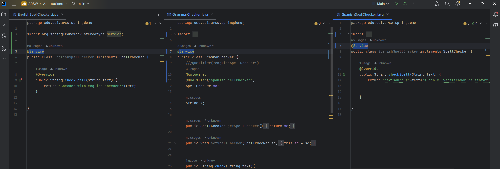
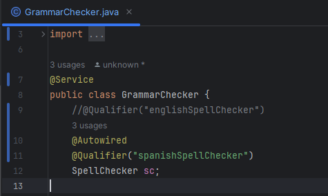
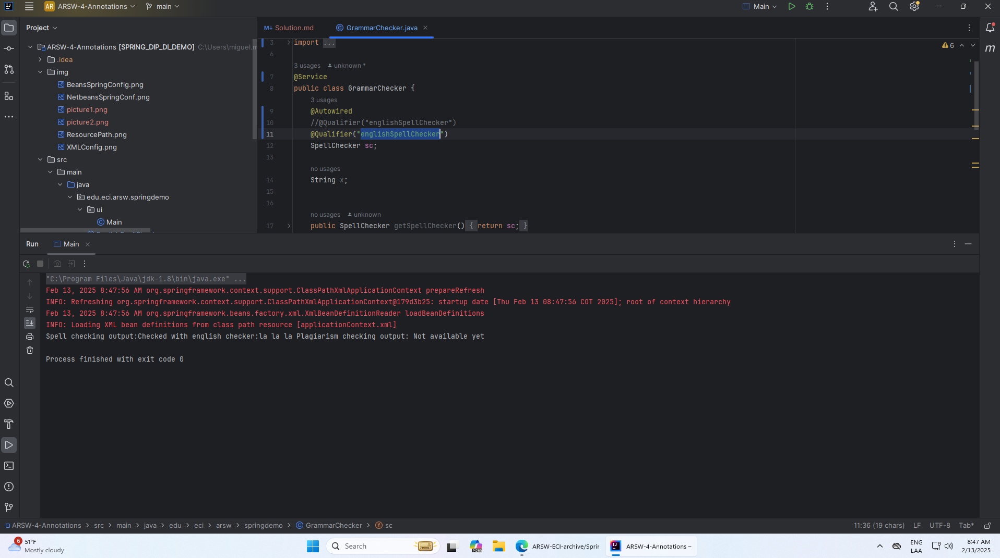
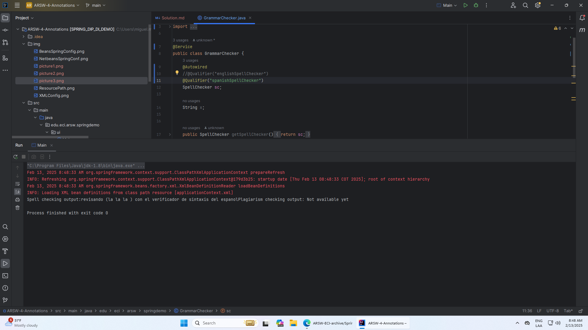

## Ejercicio Inyección de Dependencias con Anotaciones en Springboot
### Integrantes
#### Santiago Avellaneda y Miguel Motta

----- 

### Solución
> Para resolver este ejercicio, primero usamos las anotaciones de Spring para configurar los `Beans` 
> que se inyectan automáticamente:
> 
> 
> 
> Para hacer la especificación de qué dependencia se va a inyectar, usamos la anotación `Qualifier`
> que ofrece Springboot:
> 
> 
>
> Luego lo ejecutamos, con la inyección especificada de `EnglishSpellChecker`:
> 
> 
> 
> Luego cambiamos la clase que vamos a inyectar en el `Qualifier` para que se inyecte
> la depenencia de `SpanishSpellChecker`:
> 
> 
> 
